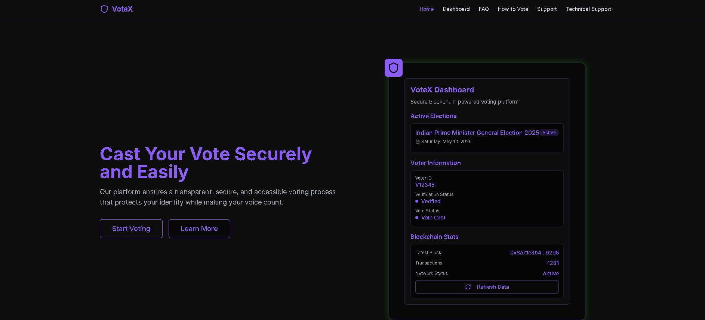
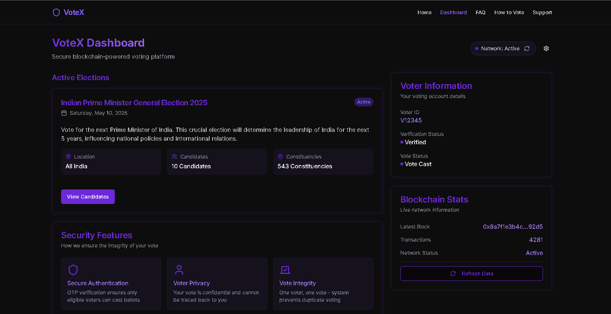

# VoteX - Blockchain-Based Voting Platform

<div align="center">
  <h1>VoteX</h1>
  <p><strong>Secure Blockchain Voting for Indian General Elections 2025</strong></p>
</div>

## Overview

VoteX is a cutting-edge blockchain-based voting platform designed for the Indian General Elections 2025. It ensures a transparent, secure, and accessible voting process that protects voter identity while making every vote count. Using zero-knowledge proofs and advanced cryptography, VoteX maintains complete voter privacy while providing full election transparency and verifiability.

## Key Features

### For Voters
- **Secure Authentication** - Verify identity with Voter ID and Aadhaar-linked OTP
- **Private Voting** - Cast votes securely with encrypted voting system
- **Vote Verification** - Verify your vote was recorded correctly without revealing your choice
- **Instant Confirmation** - Receive immediate confirmation of successful vote recording
- **Multi-language Support** - Interface available in 12 regional Indian languages

### For Election Officials
- **Real-time Monitoring** - Track voter turnout and system status in real-time
- **Blockchain Transparency** - Complete audit trail with immutable record of all votes
- **Zero-Knowledge Proofs** - Maintain vote secrecy while ensuring system integrity 
- **Advanced Security** - Protection against tampering and fraudulent votes
- **Technical Support** - Specialized support team for blockchain and system issues

## Screenshots

<div align="center">
  <table>
    <tr>
      <td width="50%">
        
        <p align="center"><strong>Secure Blockchain Voting Landing Page</strong></p>
      </td>
      <td width="50%">
        
        <p align="center"><strong>Interactive Voting Dashboard</strong></p>
      </td>
    </tr>
  </table>
</div>

## Technology Stack

- **Frontend**: React 18, TypeScript, Vite
- **UI**: Tailwind CSS, shadcn/ui components
- **State Management**: React Context API, TanStack Query
- **Blockchain**: Custom ECI blockchain with zero-knowledge proofs
- **Cryptography**: Advanced encryption for vote privacy
- **Authentication**: Multi-factor authentication with Aadhaar verification

## Project Structure

```
votex/
├── public/            # Static assets
├── src/
│   ├── components/    # Reusable UI components
│   │   ├── layout/    # Layout components (Header, Footer)
│   │   └── ui/        # UI component library
│   ├── hooks/         # Custom React hooks
│   ├── lib/           # Utility libraries
│   ├── pages/         # Application pages
│   │   ├── Dashboard.tsx
│   │   ├── FAQ.tsx
│   │   ├── HowToVote.tsx
│   │   ├── Support.tsx
│   │   ├── TechnicalSupport.tsx
│   │   └── VotePage.tsx
│   └── services/      # Service layer for API calls
├── votex-api/         # Backend API services
└── package.json       # Project dependencies
```

## Getting Started

### Prerequisites

- Node.js (v16+)
- npm or yarn

### Installation

1. Clone the repository:
   ```bash
   git clone https://github.com/sachinskyte/Votex.git
   cd Votex
   ```

2. Install dependencies:
   ```bash
   npm install
   # or
   yarn install
   ```

3. Start the development server:
   ```bash
   npm run dev
   # or
   yarn dev
   ```

4. Open your browser and navigate to `http://localhost:5173`

## Contributing

We welcome contributions from developers interested in blockchain voting technology:

1. Fork the repository
2. Create your feature branch (`git checkout -b feature/blockchain-enhancement`)
3. Commit your changes (`git commit -m 'Add enhanced verification protocol'`)
4. Push to the branch (`git push origin feature/blockchain-enhancement`)
5. Open a Pull Request

### Development Guidelines

- Follow the existing code style and conventions
- Write clean, modular, and maintainable code
- Include detailed comments for cryptographic implementations
- Ensure all cryptographic protocols maintain vote privacy
- Test thoroughly for security vulnerabilities

---

<div align="center">
  <p>© 2025 VoteX - Election Commission of India. All rights reserved.</p>
  <p>
    <a href="https://votex-eci.vercel.app">Website</a> •
    <a href="https://github.com/sachinskyte/Votex">GitHub</a>
  </p>
</div>
